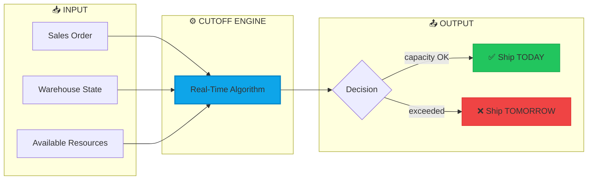
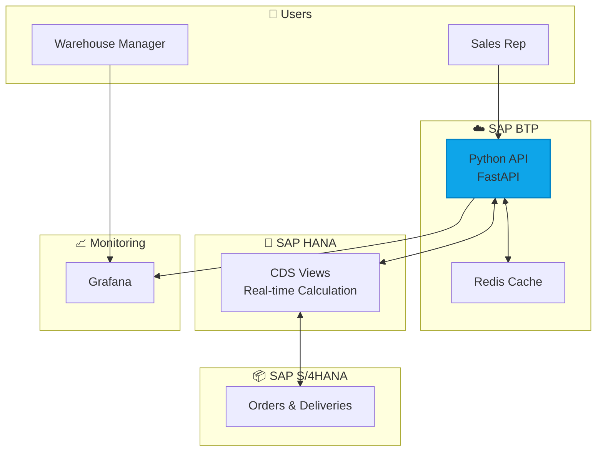
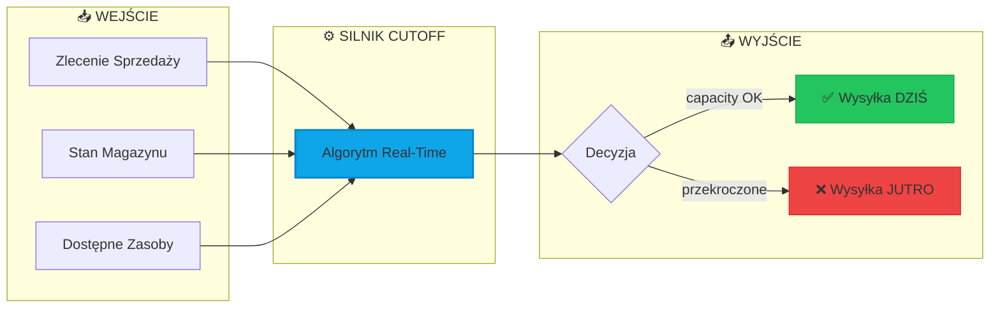
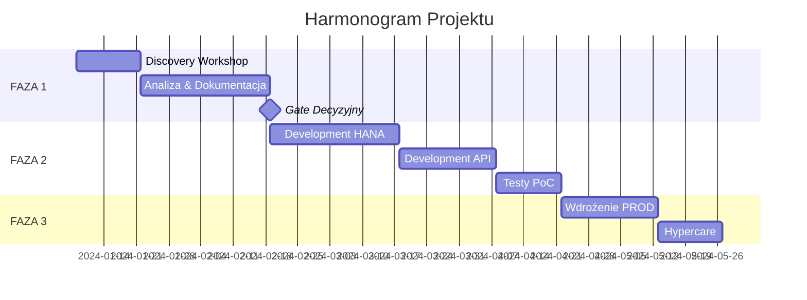

# 🚀 Warehouse Cutoff Time System

> **Real-time Decision Engine for Same-Day Shipping**  
> System Oceny Obciążenia Magazynu - Mechanizm Decyzyjny Real-Time

[](docs/02-architecture.md)
[]()
[](LICENSE)

---

## 🌐 Language / Język

- [English](#-english)
- [Polski](#-polski)

---

# 🇬🇧 English

## 📋 Overview

This repository contains the **complete architectural documentation** for a Real-Time Warehouse Capacity Management System. The system automatically determines the **Cutoff Time** - the latest moment when sales orders can be accepted for same-day shipping.

### 🎯 Problem Statement

| Challenge | Impact |
|-----------|--------|
| No visibility into warehouse load | 72% same-day delivery rate |
| Manual cutoff time decisions | 15 customer complaints/week |
| Reactive instead of proactive | 40h overtime/week |

### 💡 Solution



### 🏗️ Architecture Overview



### 📊 Key Metrics (Expected Outcomes)

| Metric | Before | After | Improvement |
|--------|--------|-------|-------------|
| Same-Day Delivery Rate | 72% | 85% | +18% |
| Promise Accuracy | 65% | 90% | +38% |
| Weekly Complaints | 15 | 5 | -67% |
| Overtime Hours | 40h | 20h | -50% |
| API Response Time | N/A | <500ms | - |

### 📁 Documentation Structure

```
📂 cutoff-time-architecture/
├── 📄 README.md                    ← You are here
├── 📂 docs/
│   ├── 01-executive-summary.md     ← Business overview
│   ├── 02-architecture.md          ← C4 diagrams, tech stack
│   ├── 03-algorithm.md             ← Decision logic, math model
│   ├── 04-data-model.md            ← ERD, SAP tables mapping
│   ├── 05-api-specification.md     ← REST API (OpenAPI)
│   └── 06-implementation-plan.md   ← Timeline, risks, KPIs
├── 📂 adr/
│   └── ADR-001-technology-choice.md
├── 📄 index.html                   ← Interactive visualization
└── 📄 LICENSE
```

### 🚀 Quick Links

| Document | Description |
|----------|-------------|
| [📊 Interactive Visualization](https://lesnijan.github.io/cutoff-time-architecture/) | Full interactive diagrams |
| [🏗️ Architecture](docs/02-architecture.md) | C4 Model, Container Diagram |
| [🧮 Algorithm](docs/03-algorithm.md) | Decision flowchart, math model |
| [🗄️ Data Model](docs/04-data-model.md) | ERD, SAP tables |
| [🔌 API Spec](docs/05-api-specification.md) | REST endpoints |

---

# 🇵🇱 Polski

## 📋 Przegląd

To repozytorium zawiera **kompletną dokumentację architektoniczną** Systemu Zarządzania Przepustowością Magazynu w czasie rzeczywistym. System automatycznie wyznacza **Cutoff Time** - ostatni moment, w którym można przyjąć zamówienia z wysyłką tego samego dnia.

### 🎯 Problem Biznesowy

| Wyzwanie | Skutek |
|----------|--------|
| Brak widoczności obciążenia magazynu | 72% wysyłek tego samego dnia |
| Ręczne ustalanie cutoff time | 15 reklamacji tygodniowo |
| Reakcyjne zamiast proaktywnego podejścia | 40h nadgodzin tygodniowo |

### 💡 Rozwiązanie



### 🛠️ Stos Technologiczny

| Warstwa | Technologia | Rola |
|---------|-------------|------|
| **API** | Python + FastAPI | Mikroserwis decyzyjny |
| **Baza** | SAP HANA | CDS Views, In-Memory |
| **Hosting** | SAP BTP | Cloud Foundry |
| **Monitoring** | Grafana + OpenSearch | Dashboardy, alerty |
| **Integracja** | SAP Event Mesh | Event-driven |

### 📅 Fazy Projektu



### 💰 Budżet

| Faza | Czas | Koszt (netto) |
|------|------|---------------|
| **FAZA 1:** Discovery | 92h | 25 600 PLN |
| **FAZA 2:** PoC | 120-160h | 38 400 - 51 200 PLN |
| **FAZA 3:** PROD | T&M | Do wyceny |

### 📁 Struktura Dokumentacji

| Dokument | Opis |
|----------|------|
| [📊 Wizualizacja Interaktywna](https://lesnijan.github.io/cutoff-time-architecture/) | Pełne diagramy interaktywne |
| [🏗️ Architektura](docs/02-architecture.md) | Model C4, Container Diagram |
| [🧮 Algorytm](docs/03-algorithm.md) | Flowchart decyzyjny, model matematyczny |
| [🗄️ Model Danych](docs/04-data-model.md) | ERD, mapowanie tabel SAP |
| [🔌 Specyfikacja API](docs/05-api-specification.md) | Endpointy REST |

---

## 👤 Author / Autor

**Janusz Leśniewicz**  
Solution Architect | Data Engineer | 20+ lat doświadczenia

[](https://www.linkedin.com/in/janusz-lesniewicz/)
[](https://github.com/lesnijan)

---

## 📄 License

This project is licensed under the MIT License - see the [LICENSE](LICENSE) file for details.

---

<p align="center">
  <i>Crafted with precision. From Concept to Production.</i>
</p>
