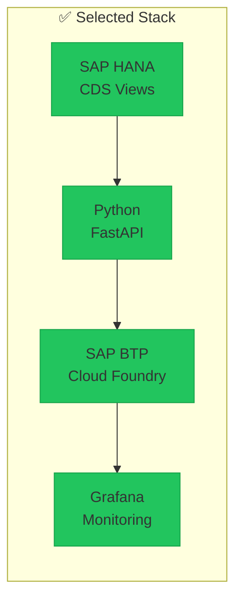

# ADR-001: Technology Stack Selection

> Architecture Decision Record

**Status:** Accepted  
**Date:** 2024-01-08  
**Deciders:** Janusz Leśniewicz, Client Technical Team

---

## Context

We need to select the technology stack for the Cutoff Time System. The system must:

1. Calculate warehouse workload in real-time (< 500ms)
2. Integrate with existing SAP S/4HANA environment
3. Provide REST API for Fiori applications
4. Support monitoring and alerting
5. Be maintainable by client's SAP team

## Decision Drivers

- **Performance:** Real-time calculations required
- **Integration:** Must work with SAP ecosystem
- **Maintainability:** Client has SAP expertise, limited Python
- **Cost:** Prefer existing licenses where possible
- **Time-to-Market:** PoC within 9 weeks

## Considered Options

### Option A: Full ABAP Stack

| Pros | Cons |
|------|------|
| Native SAP integration | Slower development |
| Client expertise | Limited flexibility |
| No additional licensing | Performance concerns |

### Option B: SAP HANA + Python (BTP)

| Pros | Cons |
|------|------|
| Best performance (HANA In-Memory) | Requires BTP subscription |
| Flexible API (FastAPI) | Python skills needed |
| Modern architecture | Two platforms to manage |
| Easy monitoring integration | |

### Option C: External Microservice (AWS/GCP)

| Pros | Cons |
|------|------|
| Cloud-native | Data latency issues |
| Full flexibility | Security complexity |
| | Integration overhead |
| | Additional costs |

## Decision

**Selected: Option B - SAP HANA + Python (SAP BTP)**

## Rationale

1. **HANA CDS Views** - Leverage in-memory processing for complex aggregations
2. **Python/FastAPI** - Modern, fast API framework with excellent SAP BTP support
3. **SAP BTP** - Single platform, integrated security (XSUAA)
4. **Grafana** - Industry standard, flexible, cost-effective (OSS option)

## Consequences

### Positive

- Sub-100ms calculation times achievable
- Clean separation of concerns (data layer / API layer)
- Modern monitoring capabilities
- Future extensibility (ML, predictions)

### Negative

- Client needs basic Python knowledge for maintenance
- BTP subscription required (if not already present)
- Two deployment targets (HANA + BTP)

### Risks

- Python expertise gap → Mitigation: Documentation, training session
- BTP availability → Mitigation: Confirm subscription before Phase 2

## Compliance

- [x] SAP Best Practices
- [x] Client Security Requirements
- [x] Data Residency (EU)

---

## Related Documents

- [Architecture Overview](../docs/02-architecture.md)
- [API Specification](../docs/05-api-specification.md)
