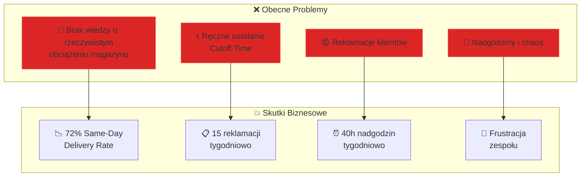
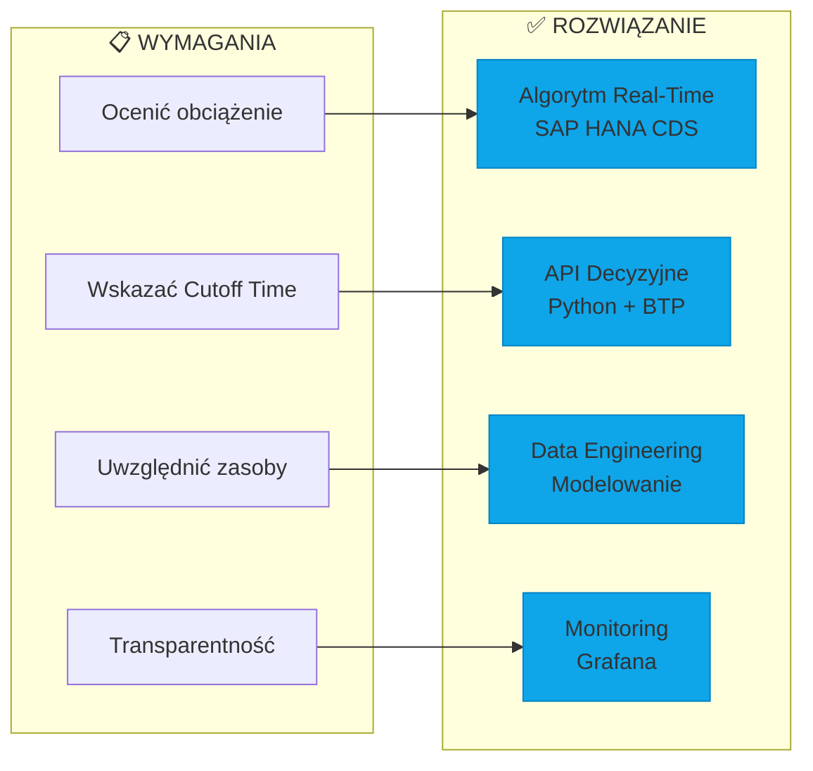

# 📋 Executive Summary

> System Oceny Obciążenia Magazynu - Cutoff Time Engine

[← Back to README](../README.md) | [Next: Architecture →](02-architecture.md)

---

## 🎯 Problem Statement / Opis Problemu

### Current State (AS-IS)



### Client Requirements / Wymagania Klienta

Klient potrzebuje mechanizmu, który:

| # | Wymaganie | Priorytet |
|---|-----------|-----------|
| 1 | Oceni **dzienne obciążenie magazynu** | 🔴 Krytyczne |
| 2 | Wskaże **Cutoff Time** dla wysyłek same-day | 🔴 Krytyczne |
| 3 | Uwzględni dostawy, operacje, zasoby | 🟡 Wysokie |
| 4 | Zapewni **transparentność procesu** | 🟡 Wysokie |
| 5 | Wygeneruje komunikat dla handlowców | 🟢 Średnie |

---

## 💡 Proposed Solution / Proponowane Rozwiązanie

### Solution Overview



### Key Features / Kluczowe Funkcje

1. **Real-Time Capacity Check**
   - API endpoint `/capacity/check`
   - Response time < 500ms
   - Confidence score dla każdej decyzji

2. **Dynamic Cutoff Time**
   - Automatyczne przeliczanie co 5 minut
   - Uwzględnienie zmienności w ciągu dnia
   - Alert przy zbliżaniu się do limitu

3. **VIP Priority Handling**
   - Rezerwacja 10% capacity dla VIP
   - Override dla kluczowych klientów
   - Audit trail wszystkich decyzji

4. **Operational Dashboard**
   - Real-time utilization monitoring
   - Trend analysis
   - Proactive alerting

---

## 📊 Expected Outcomes / Oczekiwane Rezultaty

### Business KPIs

| Metryka | Przed | Po | Poprawa |
|---------|-------|-----|---------|
| Same-Day Delivery Rate | 72% | 85% | **+18%** |
| Promise Accuracy | 65% | 90% | **+38%** |
| Reklamacje/tydzień | 15 | 5 | **-67%** |
| Nadgodziny/tydzień | 40h | 20h | **-50%** |

### Technical KPIs

| Metryka | Target |
|---------|--------|
| API Response Time (p95) | < 500ms |
| API Availability | 99.5% |
| Calculation Accuracy | ±10% |
| Data Freshness | < 5 min |

---

## 💰 Investment / Inwestycja

### Project Phases

| Faza | Zakres | Czas | Koszt |
|------|--------|------|-------|
| **FAZA 1** | Discovery & Design | 6 tyg | 25 600 PLN |
| **FAZA 2** | PoC Implementation | 9 tyg | 38 400 - 51 200 PLN |
| **FAZA 3** | Production & Monitoring | 5 tyg | T&M |
| **TOTAL** | - | ~20 tyg | ~90 000 PLN |

### ROI Estimation

```
Oszczędności roczne:
- Redukcja nadgodzin: 20h/tyg × 50 tyg × 50 PLN = 50 000 PLN
- Redukcja reklamacji: 10/tyg × 50 tyg × 200 PLN = 100 000 PLN
- Wzrost sprzedaży (same-day): +13% × revenue = ???

Szacowany ROI: 6-9 miesięcy
```

---

## ✅ Recommendation / Rekomendacja

**Rekomendujemy rozpoczęcie projektu od FAZY 1 (Discovery)**, która pozwoli:

1. Zweryfikować założenia techniczne
2. Zdefiniować formalny algorytm obciążenia
3. Ocenić możliwości istniejących narzędzi (Cognos)
4. Przygotować szczegółową wycenę FAZY 2

**Gate Decyzyjny** po FAZIE 1 pozwoli podjąć świadomą decyzję o kontynuacji projektu.

---

[← Back to README](../README.md) | [Next: Architecture →](02-architecture.md)
