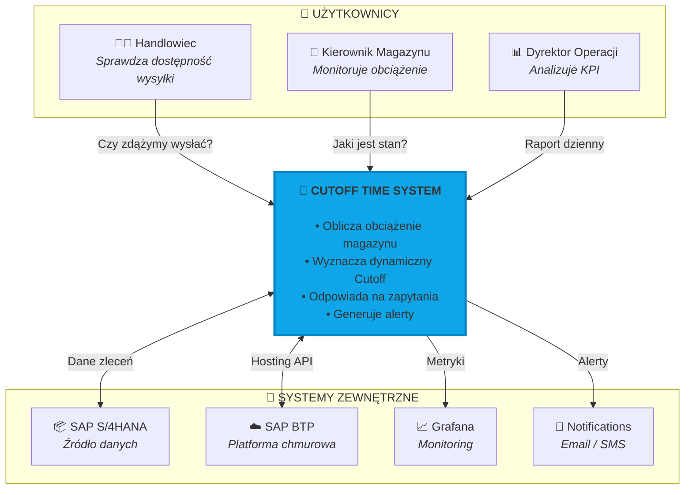
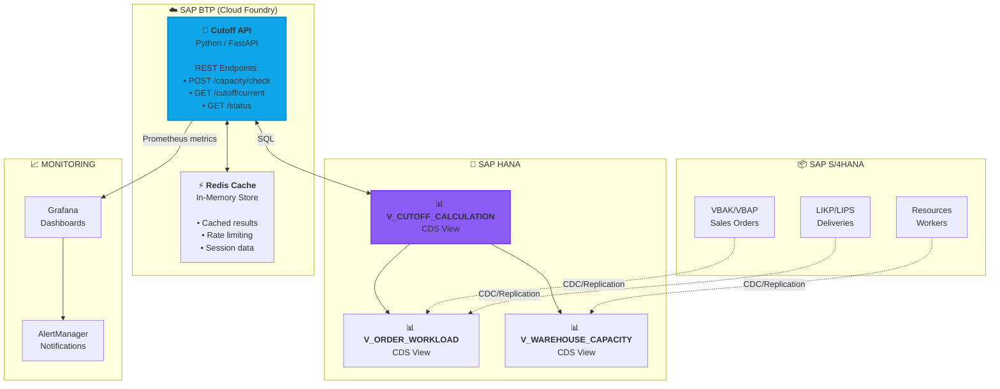
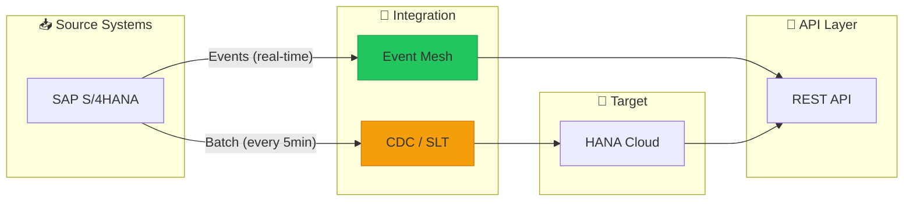
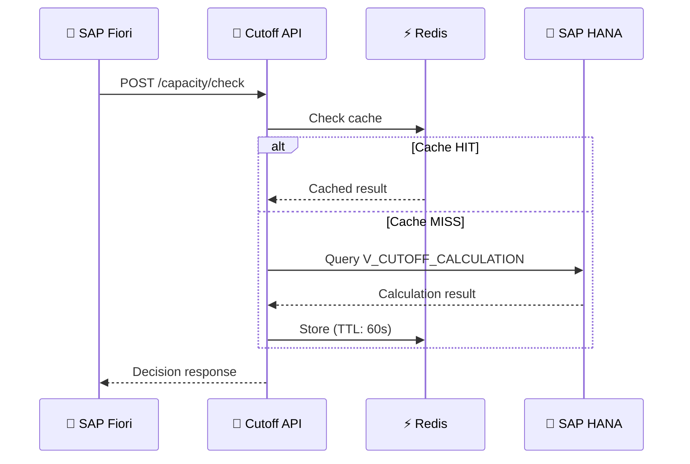
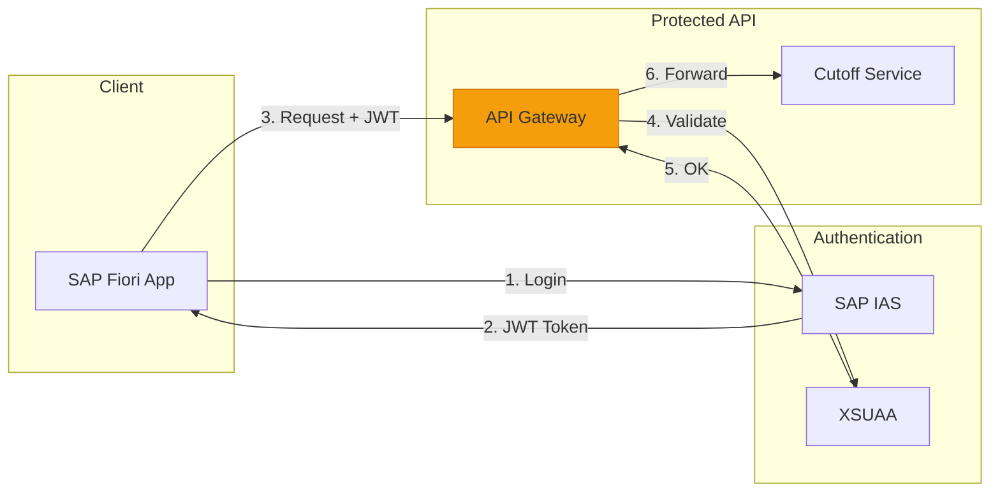
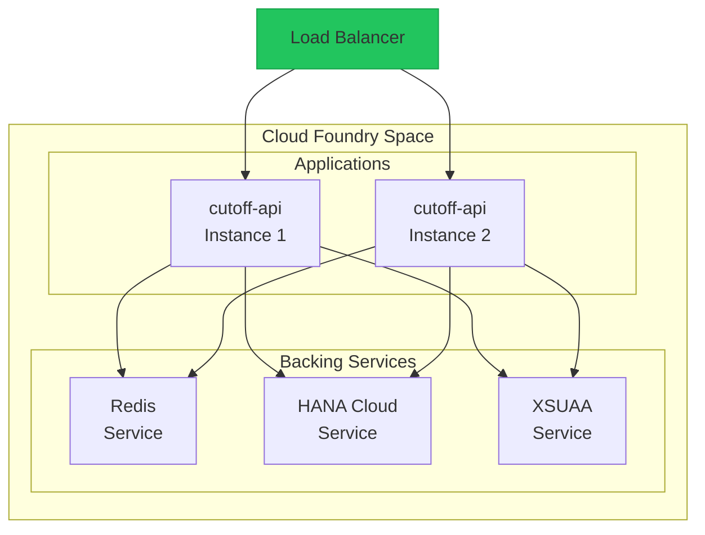

# 🏗️ Architecture

> C4 Model - System Architecture Documentation

[← Executive Summary](01-executive-summary.md) | [Next: Algorithm →](03-algorithm.md)

---

## 📐 C4 Model Overview

C4 Model to hierarchiczny sposób opisu architektury na 4 poziomach:
1. **Context** - system i jego otoczenie
2. **Container** - komponenty wysokopoziomowe
3. **Component** - wewnętrzna struktura kontenerów
4. **Code** - szczegóły implementacji

---

## Level 1: System Context Diagram

Widok z lotu ptaka - system i jego interakcje z użytkownikami oraz zewnętrznymi systemami.

### Actors Description

| Aktor | Rola | Interakcja |
|-------|------|------------|
| **Handlowiec** | Przyjmuje zamówienia od klientów | Sprawdza czy zamówienie zdąży na wysyłkę dziś |
| **Kierownik Magazynu** | Zarządza operacjami | Monitoruje obciążenie, reaguje na alerty |
| **Dyrektor Operacji** | Decyzje strategiczne | Analizuje trendy, KPI, planuje zasoby |

---

## Level 2: Container Diagram

Główne kontenery (deployable units) systemu i ich odpowiedzialności.

### Container Descriptions

| Container | Technology | Purpose |
|-----------|------------|---------|
| **Cutoff API** | Python, FastAPI | REST API serving decision endpoints |
| **Redis Cache** | Redis | Caching computed results, rate limiting |
| **V_ORDER_WORKLOAD** | HANA CDS View | Calculates workload per order |
| **V_WAREHOUSE_CAPACITY** | HANA CDS View | Calculates available capacity |
| **V_CUTOFF_CALCULATION** | HANA CDS View | Main calculation view |
| **Grafana** | Grafana OSS | Operational dashboards |

---

## 🛠️ Technology Stack

### Backend

| Layer | Technology | Version | Purpose |
|-------|------------|---------|---------|
| **Runtime** | Python | 3.11+ | API implementation |
| **Framework** | FastAPI | 0.100+ | REST API framework |
| **Database** | SAP HANA | 2.0 | In-memory calculations |
| **Cache** | Redis | 7.x | Result caching |
| **Platform** | SAP BTP | - | Cloud hosting |

### Data Layer

| Component | Technology | Purpose |
|-----------|------------|---------|
| **Views** | CDS (Core Data Services) | Declarative data models |
| **Integration** | SAP Event Mesh | Real-time events |
| **Replication** | SLT / CDC | Data synchronization |

### Observability

| Component | Technology | Purpose |
|-----------|------------|---------|
| **Metrics** | Prometheus | Time-series metrics |
| **Dashboards** | Grafana | Visualization |
| **Logs** | OpenSearch | Log aggregation |
| **Tracing** | Jaeger | Distributed tracing |

---

## 🔀 Integration Patterns

### Data Flow Pattern

### API Integration Pattern

---

## 🔐 Security Architecture

### Authentication & Authorization

### Security Layers

| Layer | Mechanism | Purpose |
|-------|-----------|---------|
| **Transport** | TLS 1.3 | Encryption in transit |
| **Authentication** | OAuth 2.0 / JWT | Identity verification |
| **Authorization** | XSUAA Scopes | Role-based access |
| **Data** | HANA Security | Row-level security |

---

## 📦 Deployment Architecture

### SAP BTP Deployment

### Environment Strategy

| Environment | Purpose | Data |
|-------------|---------|------|
| **DEV** | Development | Synthetic data |
| **QAS** | Testing & PoC | Anonymized production data |
| **PRD** | Production | Live data |

---

## Architecture Decision Records (ADR)

Key architectural decisions are documented in [ADR folder](../adr/):

- [ADR-001: Technology Choice](../adr/ADR-001-technology-choice.md)

---

[← Executive Summary](01-executive-summary.md) | [Next: Algorithm →](03-algorithm.md)
