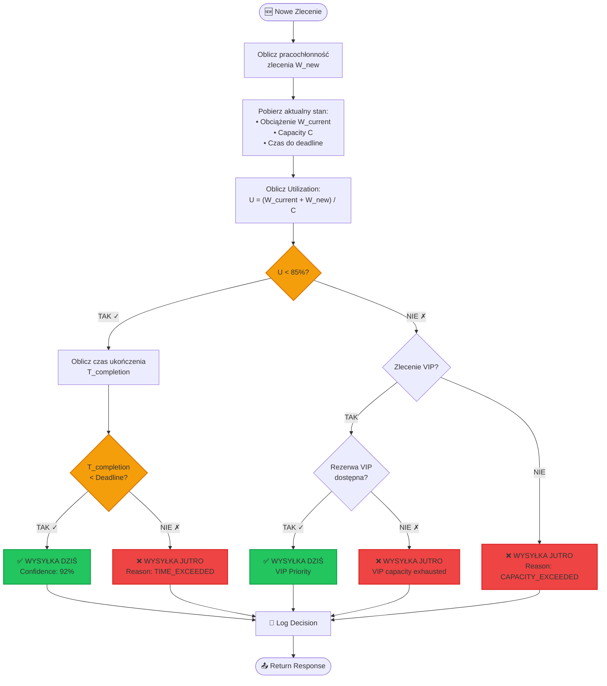
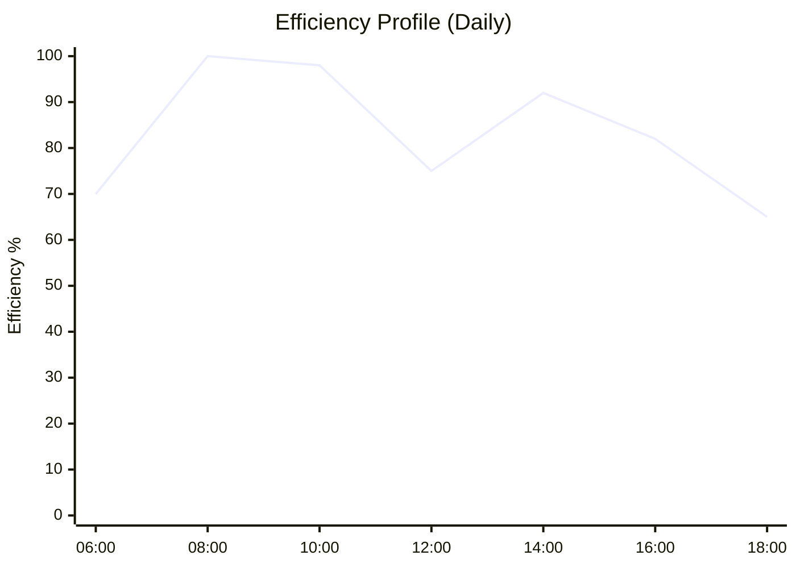
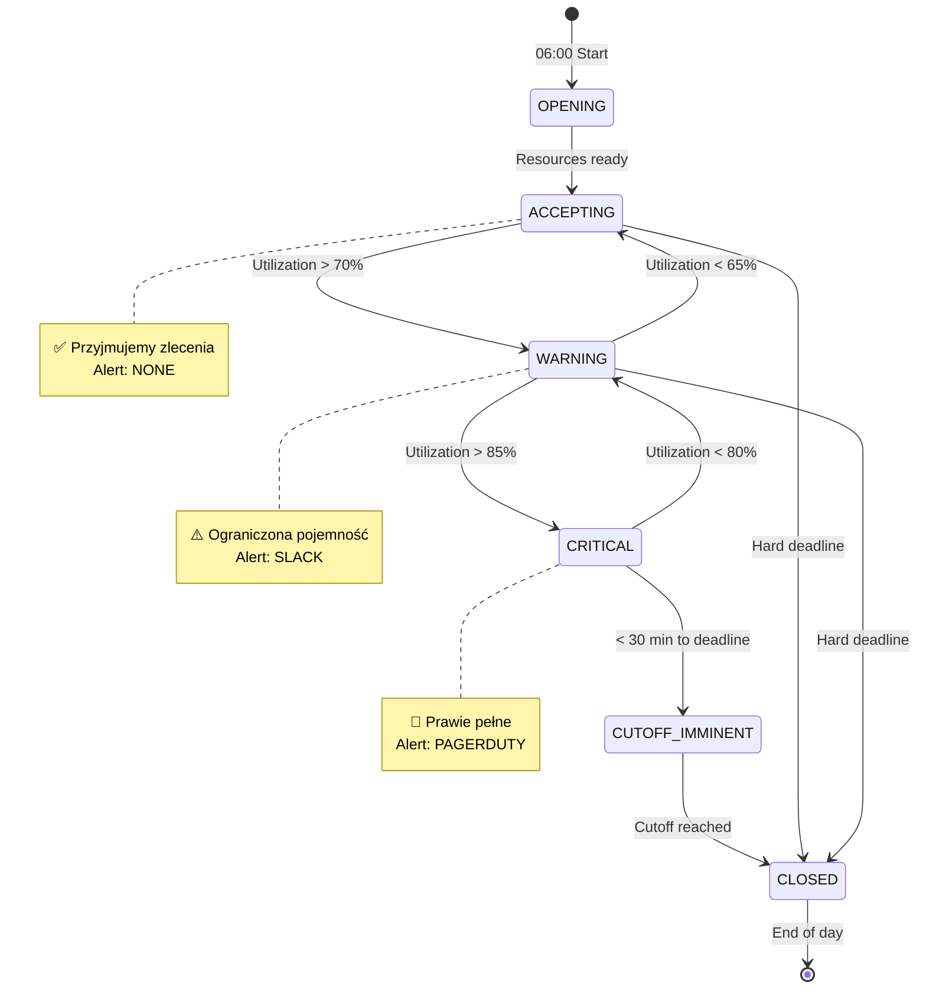
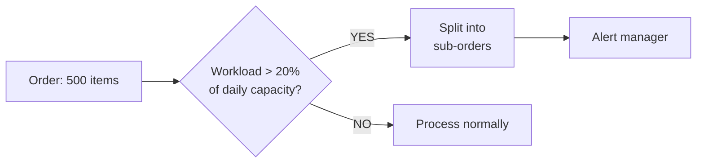
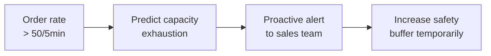
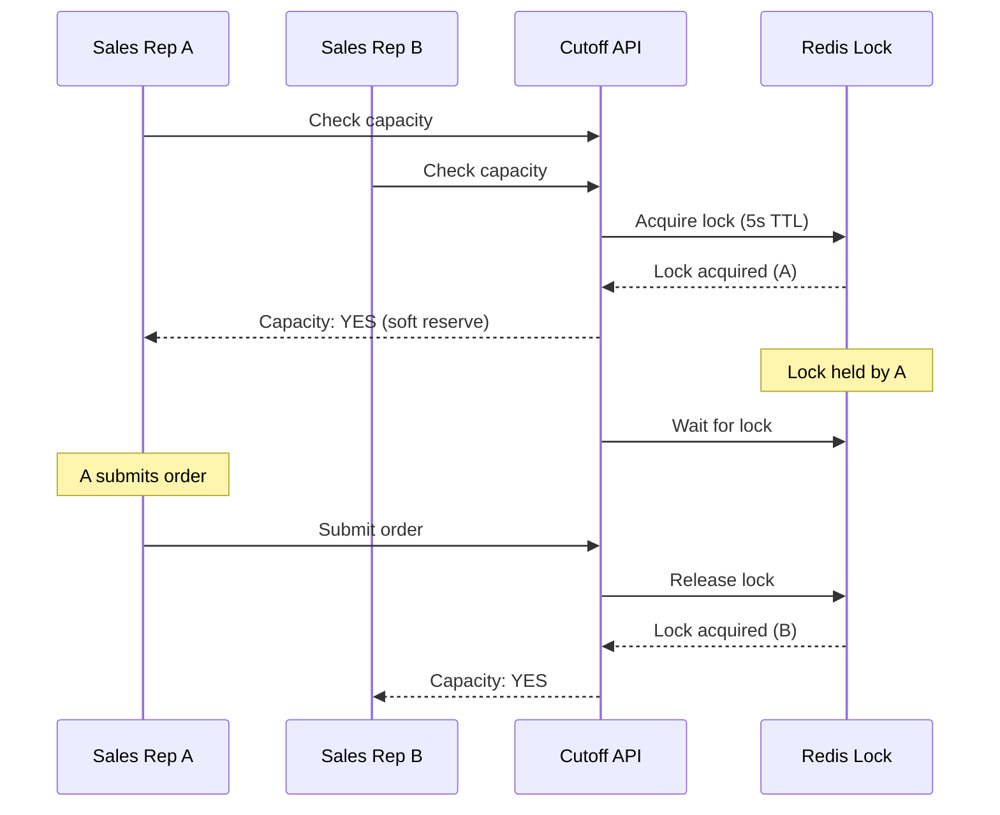

# 🧮 Algorithm Specification

> Decision Logic & Mathematical Model

[← Architecture](02-architecture.md) | [Next: Data Model →](04-data-model.md)

---

## 📋 Algorithm Overview

System podejmuje decyzję w 3 krokach:

1. **OBLICZ** pracochłonność zlecenia
2. **PORÓWNAJ** z dostępną przepustowością
3. **ZDECYDUJ** czy wysyłka dziś jest możliwa

---

## 🔀 Decision Flowchart



---

## 📐 Mathematical Model

### Core Equations

#### 1. Order Workload (Pracochłonność zlecenia)

```
W_order = Σ(quantity × weight_factor × location_factor) + S + P + L
```

Gdzie:
- `quantity` - ilość produktu
- `weight_factor` - współczynnik pracochłonności produktu (1.0 - 3.0)
- `location_factor` - współczynnik lokalizacji (1.0 = standard, 1.8 = wysoki regał)
- `S` - setup time (stały, ~2 min)
- `P` - packing time (3 min + 0.5 min/item)
- `L` - loading time (~1.5 min)

#### 2. Total Workload (Całkowite obciążenie)

```
WORKLOAD(t) = Σ W_i × progress_factor_i
```

Gdzie `progress_factor`:
| Status | Factor | Opis |
|--------|--------|------|
| NEW | 1.00 | Nierozpoczęte |
| ALLOCATED | 0.95 | Zarezerwowane |
| PICKING | 0.60 | W trakcie kompletacji |
| PACKING | 0.25 | Do pakowania |
| LOADING | 0.08 | Do załadunku |
| SHIPPED | 0.00 | Wysłane |

#### 3. Capacity (Przepustowość)

```
CAPACITY(t) = MIN(picker_cap, packer_cap, loader_cap) × efficiency(t) × (1 - VIP_reserve)
```

Gdzie:
- `picker_cap = pickers × 1.2 units/min`
- `packer_cap = packers × 0.8 units/min`
- `loader_cap = loaders × 2.0 units/min`
- `efficiency(t)` - współczynnik wydajności (zmienny w ciągu dnia)
- `VIP_reserve = 0.10` (10% rezerwacji dla VIP)

#### 4. Time Efficiency Profile



| Godzina | Efficiency | Powód |
|---------|------------|-------|
| 06:00 | 70% | Rozruch zmiany |
| 08:00 | 100% | Pełna wydajność |
| 12:00 | 75% | Przerwa obiadowa |
| 14:00 | 92% | Po przerwie |
| 16:00 | 82% | Zmęczenie |
| 18:00 | 65% | Koniec zmiany |

#### 5. Utilization

```
UTILIZATION = WORKLOAD / CAPACITY
```

**Krytyczne progi:**
- `< 70%` - ACCEPTING (zielony)
- `70-85%` - WARNING (żółty)
- `85-95%` - CRITICAL (pomarańczowy)
- `> 95%` - CLOSED (czerwony)

#### 6. Congestion Factor (Teoria Kolejek)

```
CONGESTION_FACTOR = 1 + α × UTILIZATION²
```

Gdzie `α = 1.2` (współczynnik empiryczny)

**Wyjaśnienie:** Przy wysokim wykorzystaniu czas obsługi rośnie nieliniowo z powodu:
- Kolizji pickerów w alejkach
- Kolejek przy stanowiskach pakowania
- Efektu zmęczenia

#### 7. Processing Time

```
PROC_TIME = (WORKLOAD / CAPACITY) × CONGESTION_FACTOR
```

#### 8. Decision Rule

```
IF (UTILIZATION < 0.85) AND (current_time + PROC_TIME < deadline - buffer)
THEN → "Ship Today" ✓
ELSE → "Ship Tomorrow" ✗
```

---

## 🔄 State Machine

System operacyjny magazynu przechodzi przez stany:



### State Descriptions

| State | Utilization | Actions | Alerts |
|-------|-------------|---------|--------|
| **ACCEPTING** | < 70% | All orders accepted | None |
| **WARNING** | 70-85% | Monitor closely | Slack notification |
| **CRITICAL** | 85-95% | VIP only | PagerDuty alert |
| **CUTOFF_IMMINENT** | Any, < 30min | Prepare closure | Email to sales |
| **CLOSED** | N/A | Reject all | Dashboard update |

---

## 🎲 Edge Cases

### Case 1: "Whale Order" (Mega-zlecenie)



**Handling:** Orders exceeding 20% of daily capacity are flagged for manual review or automatic splitting.

### Case 2: "Flash Flood" (Nagły zalew)



**Handling:** Rate limiting and predictive alerting when order velocity spikes.

### Case 3: "Race Condition" (Równoczesne zapytania)



**Handling:** Optimistic locking with soft reservation (5 min TTL).

---

## 📊 Algorithm Performance

### Expected Metrics

| Metric | Target | Notes |
|--------|--------|-------|
| Decision Time | < 50ms | Excluding network |
| Cache Hit Rate | > 80% | For repeated queries |
| Accuracy | ±10% | Predicted vs actual completion |
| False Positive Rate | < 5% | "Ship today" but didn't |
| False Negative Rate | < 10% | "Ship tomorrow" but could have |

### Tuning Parameters

| Parameter | Default | Range | Impact |
|-----------|---------|-------|--------|
| `MAX_UTILIZATION` | 0.85 | 0.80-0.95 | Higher = more risk |
| `SAFETY_BUFFER` | 30 min | 15-60 min | Higher = more conservative |
| `VIP_RESERVE` | 0.10 | 0.05-0.20 | Higher = less standard capacity |
| `CONGESTION_ALPHA` | 1.2 | 0.5-2.0 | Higher = more pessimistic |
| `CACHE_TTL` | 60s | 30-300s | Higher = less fresh |

---

[← Architecture](02-architecture.md) | [Next: Data Model →](04-data-model.md)
