# 🗄️ Data Model

> Entity Relationship Diagram & SAP Tables Mapping

[← Algorithm](03-algorithm.md) | [Next: API Specification →](05-api-specification.md)

---

## 📊 Entity Relationship Diagram


---

## 🔗 SAP Tables Mapping

### Mapping: Logical Entity → SAP Table


### Detailed Table Mapping

| Logical Entity | SAP Table (WM) | SAP Table (EWM) | Key Fields |
|----------------|----------------|-----------------|------------|
| **Sales Order** | VBAK | VBAK | VBELN, ERDAT, AUART |
| **Order Item** | VBAP | VBAP | VBELN, POSNR, MATNR, KWMENG |
| **Customer** | KNA1 | KNA1 | KUNNR, NAME1 |
| **Delivery Header** | LIKP | /SCWM/DLVH | VBELN, WADAT, KODAT |
| **Delivery Item** | LIPS | /SCWM/DLVI | VBELN, POSNR, MATNR |
| **Warehouse Task** | LTAP | /SCWM/WHO | TANUM, TAPOS, MATNR |
| **Product Master** | MARA | MARA | MATNR, MTART, MATKL |
| **Resource** | - | /SCWM/RSRC | RSRC, RSRC_TYPE |

---

## 📋 Key SAP Tables Detail

### VBAK - Sales Document Header

| Field | Type | Description | Usage |
|-------|------|-------------|-------|
| VBELN | CHAR(10) | Sales Document Number | Primary Key |
| ERDAT | DATE | Created Date | Filter by date |
| ERZET | TIME | Created Time | Ordering |
| AUART | CHAR(4) | Order Type | Filter (ZOR, TA) |
| KUNNR | CHAR(10) | Customer Number | VIP check |
| GBSTK | CHAR(1) | Overall Status | Filter open orders |
| NETWR | DEC(15,2) | Net Value | Prioritization |

### VBAP - Sales Document Item

| Field | Type | Description | Usage |
|-------|------|-------------|-------|
| VBELN | CHAR(10) | Sales Document | FK to VBAK |
| POSNR | NUMC(6) | Item Number | Part of PK |
| MATNR | CHAR(18) | Material Number | FK to MARA |
| KWMENG | DEC(15,3) | Order Quantity | Workload calc |
| MEINS | CHAR(3) | Unit of Measure | Conversion |
| WERKS | CHAR(4) | Plant | Filter |

### LIKP - Delivery Header

| Field | Type | Description | Usage |
|-------|------|-------------|-------|
| VBELN | CHAR(10) | Delivery Number | Primary Key |
| WADAT | DATE | Planned Ship Date | Filter today |
| KODAT | DATE | Picking Date | Status |
| KUNNR | CHAR(10) | Customer | Reference |
| VSTEL | CHAR(4) | Shipping Point | Filter |

### LTAP - Transfer Order Item

| Field | Type | Description | Usage |
|-------|------|-------------|-------|
| LGNUM | CHAR(3) | Warehouse Number | Filter |
| TANUM | CHAR(10) | Transfer Order | Primary Key |
| TAPOS | NUMC(4) | Item Number | Part of PK |
| MATNR | CHAR(18) | Material | Reference |
| PESSION | CHAR(1) | Processing Status | Progress |
| VSOLM | DEC(13,3) | Source Quantity | Workload |

---

## 🏗️ CDS Views Design

### View 1: V_ORDER_WORKLOAD

```sql
@AbapCatalog.sqlViewName: 'ZVORDWKLD'
@EndUserText.label: 'Order Workload Calculation'

define view V_ORDER_WORKLOAD as 
select from vbak as header
  inner join vbap as item
    on header.vbeln = item.vbeln
  left outer join zcustom_weight as weight
    on item.matnr = weight.matnr
{
    key header.vbeln as sales_order_id,
    key item.posnr as item_number,
    
    header.erdat as created_date,
    header.kunnr as customer_id,
    item.matnr as material_id,
    item.kwmeng as quantity,
    
    -- Workload calculation
    cast(
        item.kwmeng 
        * coalesce(weight.weight_factor, 1.0) 
        * coalesce(weight.location_factor, 1.0)
    as abap.dec(15,2)) as item_workload,
    
    -- Progress factor based on status
    case header.gbstk
        when 'A' then 1.00  -- Not processed
        when 'B' then 0.60  -- Partially processed  
        when 'C' then 0.00  -- Completed
        else 0.50
    end as progress_factor
}
where header.gbstk <> 'C'  -- Only open orders
```

### View 2: V_ORDER_WORKLOAD_AGG

```sql
@AbapCatalog.sqlViewName: 'ZVORDWKLDAGG'
@EndUserText.label: 'Aggregated Order Workload'

define view V_ORDER_WORKLOAD_AGG as
select from V_ORDER_WORKLOAD
{
    key sales_order_id,
    customer_id,
    
    sum(item_workload) as total_item_workload,
    count(*) as item_count,
    avg(progress_factor) as avg_progress_factor,
    
    -- Total order workload with overhead
    cast(
        sum(item_workload)
        + 2.0                    -- Setup
        + 3.0                    -- Packing base
        + (count(*) * 0.5)       -- Packing per item
        + 1.5                    -- Loading
    as abap.dec(15,2)) as total_order_workload,
    
    -- Remaining workload
    cast(
        (sum(item_workload) + 6.5 + (count(*) * 0.5))
        * avg(progress_factor)
    as abap.dec(15,2)) as remaining_workload
}
group by sales_order_id, customer_id
```

### View 3: V_WAREHOUSE_CAPACITY

```sql
@AbapCatalog.sqlViewName: 'ZVWHCAP'
@EndUserText.label: 'Warehouse Capacity'

define view V_WAREHOUSE_CAPACITY as
select from zwarehouse_resources as res
{
    key res.warehouse_id,
    key res.resource_date,
    
    res.available_pickers,
    res.available_packers, 
    res.available_loaders,
    
    -- Capacity calculations
    cast(res.available_pickers * 1.2 as abap.dec(15,2)) as picker_capacity,
    cast(res.available_packers * 0.8 as abap.dec(15,2)) as packer_capacity,
    cast(res.available_loaders * 2.0 as abap.dec(15,2)) as loader_capacity,
    
    -- Effective capacity (bottleneck - VIP reserve)
    cast(
        case 
            when res.available_pickers * 1.2 <= res.available_packers * 0.8
             and res.available_pickers * 1.2 <= res.available_loaders * 2.0
            then res.available_pickers * 1.2 * 0.90
            when res.available_packers * 0.8 <= res.available_loaders * 2.0
            then res.available_packers * 0.8 * 0.90
            else res.available_loaders * 2.0 * 0.90
        end
    as abap.dec(15,2)) as usable_capacity
}
where res.resource_date = $session.system_date
```

### View 4: V_CUTOFF_CALCULATION (Main)

```sql
@AbapCatalog.sqlViewName: 'ZVCUTOFF'
@EndUserText.label: 'Cutoff Time Calculation'

define view V_CUTOFF_CALCULATION as
select from V_ORDER_WORKLOAD_AGG as workload
  cross join V_WAREHOUSE_CAPACITY as capacity
{
    $session.system_date as calc_date,
    $session.system_time as calc_time,
    
    -- Aggregated workload
    sum(workload.remaining_workload) as total_remaining_workload,
    
    -- Capacity
    capacity.usable_capacity as current_capacity,
    
    -- Utilization
    cast(
        sum(workload.remaining_workload) / capacity.usable_capacity
    as abap.dec(5,4)) as current_utilization,
    
    -- Decision
    case
        when sum(workload.remaining_workload) / capacity.usable_capacity < 0.85
        then 'ACCEPTING'
        when sum(workload.remaining_workload) / capacity.usable_capacity < 0.95
        then 'CRITICAL'
        else 'CLOSED'
    end as system_status
}
group by capacity.usable_capacity, capacity.warehouse_id
```

---

## 📦 Custom Tables (Z-Tables)

### ZCUSTOM_WEIGHT - Product Workload Configuration

| Field | Type | Description |
|-------|------|-------------|
| MANDT | CLNT | Client |
| MATNR | MATNR | Material Number (PK) |
| WEIGHT_FACTOR | DEC(5,2) | Workload weight (1.0-3.0) |
| LOCATION_FACTOR | DEC(5,2) | Location difficulty (1.0-2.0) |
| HANDLING_TIME | DEC(5,2) | Extra handling (minutes) |
| LAST_UPDATED | TIMESTAMP | Last modification |

### ZWAREHOUSE_RESOURCES - Daily Resource Availability

| Field | Type | Description |
|-------|------|-------------|
| MANDT | CLNT | Client |
| WAREHOUSE_ID | CHAR(4) | Warehouse (PK) |
| RESOURCE_DATE | DATE | Date (PK) |
| SHIFT_ID | CHAR(2) | Shift (PK) |
| AVAILABLE_PICKERS | INT4 | Number of pickers |
| AVAILABLE_PACKERS | INT4 | Number of packers |
| AVAILABLE_LOADERS | INT4 | Number of loaders |
| NOTES | STRING | Comments |

---

## 🔄 Data Refresh Strategy

```mermaid
flowchart LR
    subgraph REALTIME["⚡ Real-Time"]
        E1["Order Created"]
        E2["Order Changed"]
        E3["Delivery Status"]
    end
    
    subgraph BATCH["🕐 Batch (5 min)"]
        B1["Task Status"]
        B2["Resource Updates"]
    end
    
    subgraph DAILY["📅 Daily"]
        D1["Product Weights"]
        D2["Resource Schedule"]
    end
    
    REALTIME -->|"Event Mesh"| API["Cutoff API"]
    BATCH -->|"CDC/SLT"| HANA["HANA Views"]
    DAILY -->|"Manual/Job"| CONFIG["Config Tables"]
    
    HANA --> API
    CONFIG --> HANA
```



| Data Type | Refresh Method | Frequency | Latency |
|-----------|---------------|-----------|---------|
| Orders | Event Mesh | Real-time | < 1s |
| Deliveries | Event Mesh | Real-time | < 1s |
| Task Status | CDC/SLT | 5 min | < 5 min |
| Resources | Manual/Job | Daily | N/A |
| Product Config | Manual | As needed | N/A |

---

[← Algorithm](03-algorithm.md) | [Next: API Specification →](05-api-specification.md)
