# 🔌 API Specification

> REST API Endpoints - OpenAPI 3.0

[← Data Model](04-data-model.md) | [Next: Implementation Plan →](06-implementation-plan.md)

---

## 📋 API Overview

| Endpoint | Method | Purpose |
|----------|--------|---------|
| `/capacity/check` | POST | Check if order can ship today |
| `/cutoff/current` | GET | Get current cutoff time |
| `/status` | GET | Get warehouse status dashboard |
| `/simulate` | POST | What-if analysis |
| `/health` | GET | Health check |

**Base URL:** `https://cutoff-api.cfapps.{region}.hana.ondemand.com/api/v1`

---

## 🔐 Authentication

All endpoints require OAuth 2.0 Bearer token from SAP XSUAA.

```http
Authorization: Bearer <jwt_token>
```

Required scopes:
- `cutoff.read` - For GET endpoints
- `cutoff.write` - For POST endpoints
- `cutoff.admin` - For configuration

---

## 📡 Endpoints

### POST /capacity/check

Check if a new order can be shipped today.

#### Request

```http
POST /api/v1/capacity/check
Content-Type: application/json
Authorization: Bearer <token>
```

```json
{
  "order_id": "SO-2024-001234",
  "customer_id": "CUST-5678",
  "priority": "STANDARD",
  "items": [
    {
      "product_id": "MAT-001",
      "quantity": 10
    },
    {
      "product_id": "MAT-002",
      "quantity": 5
    }
  ]
}
```

#### Request Schema


| Field | Type | Required | Description |
|-------|------|----------|-------------|
| `order_id` | string | No | Order ID for tracking |
| `customer_id` | string | No | Customer ID (for VIP check) |
| `priority` | enum | No | STANDARD, EXPRESS, VIP |
| `items` | array | Yes | List of order items |
| `items[].product_id` | string | Yes | Product/Material ID |
| `items[].quantity` | integer | Yes | Quantity (min: 1) |

#### Response (Success)

```json
{
  "can_ship_today": true,
  "confidence": 0.92,
  "estimated_completion": "2024-01-15T15:30:00Z",
  "current_utilization": 0.72,
  "message": "Wysyłka dziś możliwa ✓",
  "decision_factors": {
    "workload_impact": 12.5,
    "remaining_capacity": 45.2,
    "time_buffer_minutes": 30,
    "bottleneck_resource": "PACKERS"
  },
  "metadata": {
    "calculated_at": "2024-01-15T12:00:00Z",
    "cache_hit": false,
    "calculation_time_ms": 45
  }
}
```

#### Response (Cannot Ship)

```json
{
  "can_ship_today": false,
  "confidence": 0.98,
  "estimated_completion": "2024-01-16T10:00:00Z",
  "current_utilization": 0.91,
  "message": "Wysyłka jutro - przekroczono capacity ✗",
  "reason": "CAPACITY_EXCEEDED",
  "next_available_slot": "2024-01-16T08:00:00Z",
  "alternatives": [
    {
      "option": "SPLIT_ORDER",
      "description": "Podziel na 2 dostawy",
      "items_today": 8,
      "items_tomorrow": 7
    },
    {
      "option": "VIP_UPGRADE",
      "description": "Upgrade do VIP (+10%)",
      "available": true
    }
  ]
}
```

#### Response Codes

| Code | Description |
|------|-------------|
| 200 | Success |
| 400 | Invalid request (validation error) |
| 401 | Unauthorized |
| 429 | Rate limit exceeded |
| 500 | Internal error |
| 503 | Service unavailable (HANA down) |

---

### GET /cutoff/current

Get the current dynamic cutoff time.

#### Request

```http
GET /api/v1/cutoff/current?warehouse_id=WH-MAIN
Authorization: Bearer <token>
```

#### Query Parameters

| Parameter | Type | Required | Default | Description |
|-----------|------|----------|---------|-------------|
| `warehouse_id` | string | No | WH-MAIN | Warehouse identifier |

#### Response

```json
{
  "cutoff_time": "2024-01-15T14:30:00Z",
  "hard_deadline": "2024-01-15T16:00:00Z",
  "current_time": "2024-01-15T12:00:00Z",
  "time_remaining_minutes": 150,
  "current_utilization": 0.78,
  "orders_in_queue": 47,
  "estimated_orders_remaining": 12,
  "status": "WARNING",
  "trend": "INCREASING",
  "alert_level": "YELLOW",
  "status_history": [
    {"time": "11:00", "status": "ACCEPTING", "utilization": 0.65},
    {"time": "11:30", "status": "ACCEPTING", "utilization": 0.71},
    {"time": "12:00", "status": "WARNING", "utilization": 0.78}
  ]
}
```

#### Status Values

```mermaid
stateDiagram-v2
    ACCEPTING --> WARNING: util > 70%
    WARNING --> CRITICAL: util > 85%
    CRITICAL --> CLOSED: util > 95%
    
    note right of ACCEPTING: 🟢 Green
    note right of WARNING: 🟡 Yellow
    note right of CRITICAL: 🟠 Orange
    note right of CLOSED: 🔴 Red
```



---

### GET /status

Get comprehensive warehouse status for dashboard.

#### Request

```http
GET /api/v1/status
Authorization: Bearer <token>
```

#### Response

```json
{
  "timestamp": "2024-01-15T12:00:00Z",
  "warehouse_id": "WH-MAIN",
  
  "cutoff": {
    "cutoff_time": "2024-01-15T14:30:00Z",
    "status": "WARNING",
    "trend": "INCREASING"
  },
  
  "workload": {
    "total_orders": 47,
    "total_workload_units": 523.5,
    "by_status": {
      "NEW": 12,
      "PICKING": 18,
      "PACKING": 10,
      "LOADING": 7
    },
    "by_priority": {
      "STANDARD": 40,
      "EXPRESS": 5,
      "VIP": 2
    }
  },
  
  "capacity": {
    "total_capacity": 720.0,
    "used_capacity": 561.6,
    "available_capacity": 158.4,
    "utilization": 0.78,
    "resources": {
      "pickers": {
        "available": 8,
        "utilization": 0.75,
        "efficiency": 0.92
      },
      "packers": {
        "available": 5,
        "utilization": 0.88,
        "efficiency": 0.85
      },
      "loaders": {
        "available": 3,
        "utilization": 0.60,
        "efficiency": 0.95
      }
    },
    "bottleneck": "PACKERS"
  },
  
  "decisions_today": {
    "total": 285,
    "approved": 234,
    "rejected": 51,
    "vip_override": 8,
    "approval_rate": 0.82
  },
  
  "alerts": [
    {
      "level": "WARNING",
      "code": "UTIL_HIGH",
      "message": "Utilization exceeded 75%",
      "timestamp": "2024-01-15T11:45:00Z"
    }
  ]
}
```

---

### POST /simulate

What-if analysis - simulate adding multiple orders.

#### Request

```json
{
  "scenario_name": "Flash Sale Impact",
  "orders": [
    {"product_id": "MAT-001", "quantity": 100},
    {"product_id": "MAT-002", "quantity": 50}
  ],
  "time_horizon_minutes": 60
}
```

#### Response

```json
{
  "scenario_name": "Flash Sale Impact",
  "current_state": {
    "utilization": 0.78,
    "cutoff_time": "2024-01-15T14:30:00Z"
  },
  "simulated_state": {
    "utilization": 0.94,
    "cutoff_time": "2024-01-15T13:15:00Z",
    "status": "CRITICAL"
  },
  "impact": {
    "utilization_delta": 0.16,
    "cutoff_shift_minutes": -75,
    "orders_at_risk": 8
  },
  "recommendations": [
    "Consider adding 2 packers",
    "Alert sales team to slow order intake",
    "Prepare overtime authorization"
  ]
}
```

---

### GET /health

Health check endpoint (no auth required).

#### Response

```json
{
  "status": "healthy",
  "version": "1.0.0",
  "timestamp": "2024-01-15T12:00:00Z",
  "checks": {
    "hana": "ok",
    "redis": "ok",
    "event_mesh": "ok"
  },
  "uptime_seconds": 86400
}
```

---

## 📊 Response Flow Diagram


---

## ⚠️ Error Responses

### Validation Error (400)

```json
{
  "error": "VALIDATION_ERROR",
  "message": "Invalid request",
  "details": [
    {
      "field": "items[0].quantity",
      "error": "Must be positive integer"
    }
  ],
  "request_id": "req-12345"
}
```

### Rate Limit (429)

```json
{
  "error": "RATE_LIMIT_EXCEEDED",
  "message": "Too many requests",
  "retry_after_seconds": 60,
  "limit": "100 requests per minute"
}
```

### Service Unavailable (503)

```json
{
  "error": "SERVICE_UNAVAILABLE",
  "message": "HANA database connection failed",
  "fallback_available": true,
  "fallback_cutoff": "2024-01-15T14:00:00Z"
}
```

---

## 🔄 Rate Limits

| Endpoint | Limit | Window |
|----------|-------|--------|
| `/capacity/check` | 100 | 1 minute |
| `/cutoff/current` | 300 | 1 minute |
| `/status` | 60 | 1 minute |
| `/simulate` | 10 | 1 minute |

---

## 📝 OpenAPI Specification

Full OpenAPI 3.0 spec available at:
- **Swagger UI:** `/api/docs`
- **ReDoc:** `/api/redoc`
- **JSON:** `/api/openapi.json`

---

[← Data Model](04-data-model.md) | [Next: Implementation Plan →](06-implementation-plan.md)
