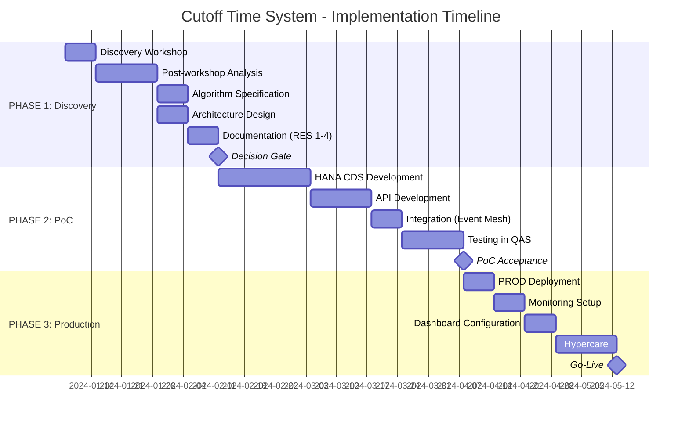
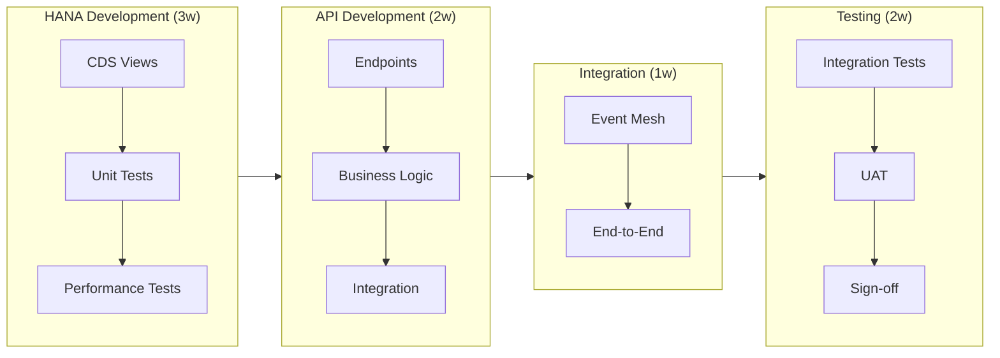
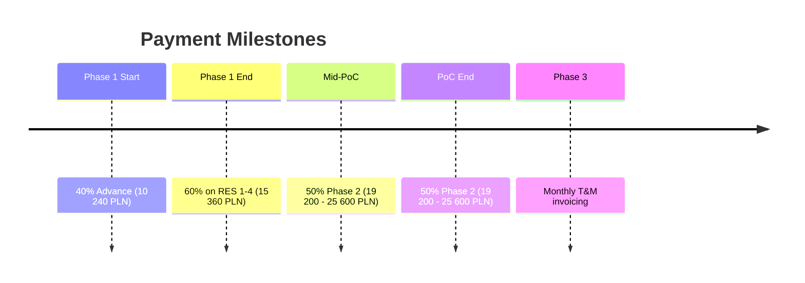
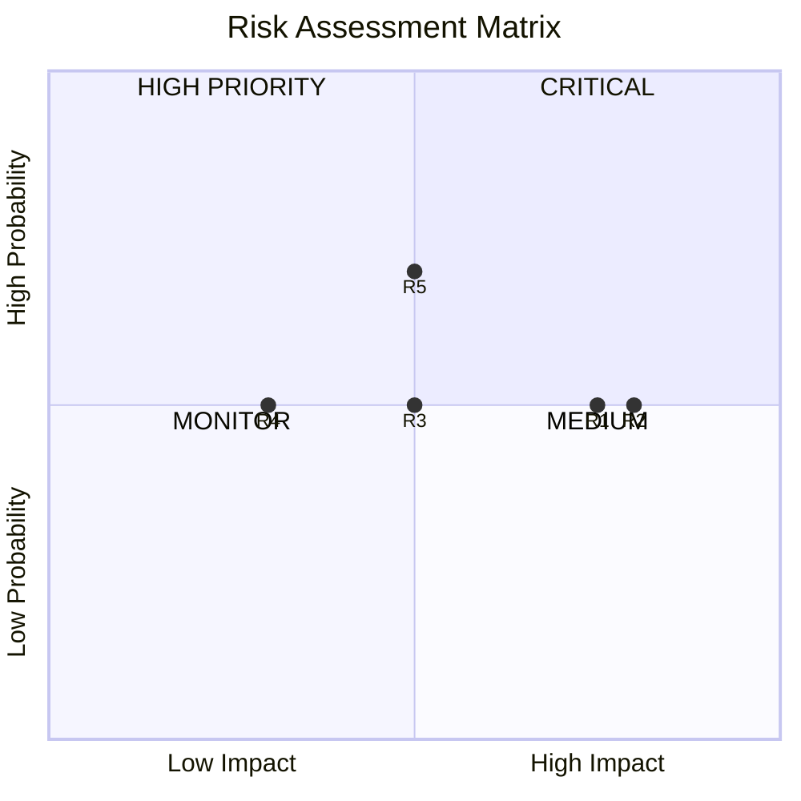
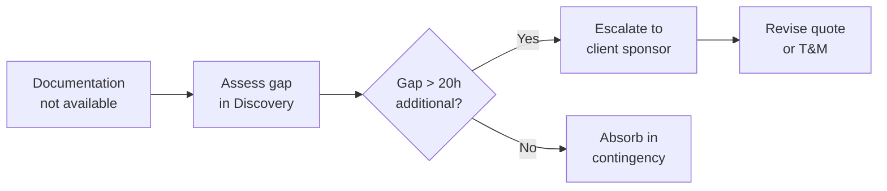
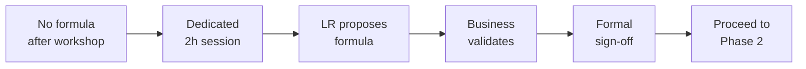
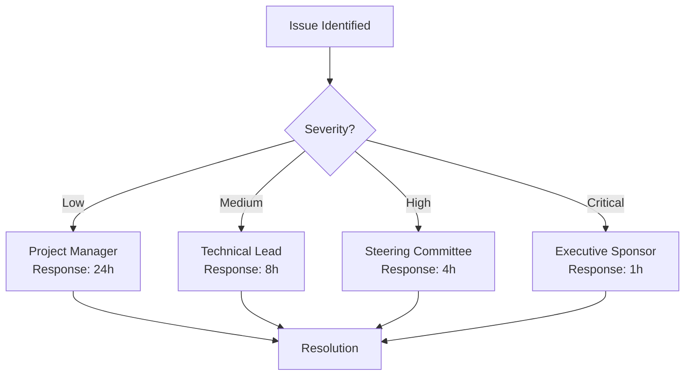

# 📅 Implementation Plan

> Timeline, Risks, and KPIs

[← API Specification](05-api-specification.md) | [Back to README →](../README.md)

---

## 📊 Project Phases



---

## 📋 Phase Details

### PHASE 1: Discovery & Design (6 weeks)

| Week | Activity | Deliverable |
|------|----------|-------------|
| 1-2 | Discovery Workshop | Process map, requirements |
| 2-3 | Data Analysis | SAP tables mapping |
| 3-4 | Algorithm Design | Mathematical model |
| 4-5 | Architecture | C4 diagrams, ADR |
| 5-6 | Documentation | RES 1-4 package |

**Deliverables (RES 1-4):**
- RES 1: Algorithm Specification
- RES 2: Integration Architecture
- RES 3: Phase 2 Detailed Quote
- RES 4: BI Tools Assessment

**Gate Criteria:**
- [ ] Algorithm approved by business
- [ ] Data sources confirmed
- [ ] Environment access granted
- [ ] Phase 2 budget approved

---

### PHASE 2: Proof of Concept (9 weeks)



| Week | Activity | Owner |
|------|----------|-------|
| 8-10 | CDS Views Development | LR Systems |
| 10 | Mid-PoC Review | Joint |
| 11-12 | Python API Development | LR Systems |
| 13 | Event Mesh Integration | Joint |
| 14-15 | QAS Testing | Joint |
| 15 | PoC Acceptance | Client |

**Deliverables:**
- RES 5: Working API in QAS
- RES 6: Source code & documentation

---

### PHASE 3: Production (5 weeks)

| Week | Activity | Responsibility |
|------|----------|----------------|
| 17 | PROD Deployment | Joint |
| 18 | Grafana Setup | LR Systems |
| 19 | Alerting Config | Joint |
| 20-21 | Hypercare | LR Systems |

**Go-Live Criteria:**
- [ ] All tests passed in PROD
- [ ] Dashboards operational
- [ ] Alerts configured
- [ ] Runbook documented
- [ ] Support handover complete

---

## 💰 Budget Summary

| Phase | Effort | Rate | Total (Net) |
|-------|--------|------|-------------|
| **PHASE 1** | 92h | 278 PLN/h | **25 600 PLN** |
| **PHASE 2** | 120-160h | 278 PLN/h | **38 400 - 51 200 PLN** |
| **PHASE 3** | T&M | 278 PLN/h | **~20 000 PLN** |
| **TOTAL** | ~300h | - | **~90 000 PLN** |

### Payment Schedule



---

## ⚠️ Risk Assessment

### Risk Matrix



### Risk Register

| ID | Risk | Prob. | Impact | Mitigation |
|----|------|-------|--------|------------|
| **R1** | Missing SAP documentation | Medium | High | Deep Dive in Discovery; RFI before start |
| **R2** | Undefined "workload" definition | Medium | High | Dedicated workshop; formal sign-off |
| **R3** | Environment access delays | Medium | Medium | RFI includes contact person; prerequisite |
| **R4** | Cognos lacks real-time | Medium | Low | Assessment in Phase 1; Grafana fallback |
| **R5** | Variable warehouse load | High | Medium | PoC with real data; iterative tuning |

### Risk Response Plan

#### R1: Missing SAP Documentation



#### R2: Undefined Workload



---

## 📊 Success Metrics (KPIs)

### Business KPIs

| Metric | Baseline | Target | Stretch | Measurement |
|--------|----------|--------|---------|-------------|
| Same-Day Delivery Rate | 72% | 85% | 92% | Orders shipped same day / total |
| Promise Accuracy | 65% | 90% | 95% | Shipped when promised / promised |
| Weekly Complaints | 15 | 5 | 2 | Shipping-related complaints |
| Overtime Hours | 40h/w | 20h/w | 10h/w | Unplanned overtime |
| Manual Overrides | 25% | 10% | 5% | Override decisions / total |

### Technical KPIs

| Metric | Target | Measurement |
|--------|--------|-------------|
| API Response Time (p95) | < 500ms | 95th percentile latency |
| API Availability | 99.5% | Uptime percentage |
| Calculation Accuracy | ±10% | Predicted vs actual |
| Data Freshness | < 5 min | Lag from source |
| Error Rate | < 1% | Failed requests / total |

### Dashboard Preview

```
┌─────────────────────────────────────────────────────────────────┐
│                    CUTOFF TIME DASHBOARD                        │
├─────────────────────────────────────────────────────────────────┤
│                                                                 │
│  ┌──────────┐  ┌──────────┐  ┌──────────┐  ┌──────────┐       │
│  │  CUTOFF  │  │   UTIL   │  │  ORDERS  │  │  STATUS  │       │
│  │  14:30   │  │   78%    │  │    47    │  │ WARNING  │       │
│  └──────────┘  └──────────┘  └──────────┘  └──────────┘       │
│                                                                 │
│  Utilization Trend                                             │
│  100% ─────────────────────────────── threshold                │
│   85% ─ ─ ─ ─ ─ ─ ─ ─ ─ ─ ─ ─ ─ ─ ─ ─ warning                 │
│        ╱╲    ╱╲                                                 │
│       ╱  ╲  ╱  ╲    ╱╲                                          │
│      ╱    ╲╱    ╲  ╱  ╲                                         │
│     ╱            ╲╱    ╲  ← current                            │
│    ╱                                                            │
│   06:00   09:00   12:00   15:00   NOW                          │
│                                                                 │
│  Recent Decisions: ✓234 approved │ ✗51 rejected │ ⭐8 VIP     │
│                                                                 │
└─────────────────────────────────────────────────────────────────┘
```

---

## 👥 Team & Responsibilities

### RACI Matrix

| Activity | LR Systems | Client IT | Client Business |
|----------|------------|-----------|-----------------|
| Algorithm Design | **R** | C | **A** |
| CDS Development | **R/A** | C | I |
| API Development | **R/A** | C | I |
| Testing | **R** | **R** | **A** |
| UAT | S | C | **R/A** |
| Deployment | **R** | **R** | A |
| Monitoring Setup | **R** | C | I |

**Legend:** R=Responsible, A=Accountable, C=Consulted, I=Informed

### Client Resources Required

| Role | Phase 1 | Phase 2 | Phase 3 |
|------|---------|---------|---------|
| Product Owner | 4h/w | 2h/w | 2h/w |
| Warehouse Manager | 8h total | 4h total | 2h total |
| SAP Basis Admin | 8h setup | 2h/w | 2h/w |
| SAP BTP Admin | - | 4h setup | 2h/w |
| BI Analyst | 2h | - | 4h |

---

## 📞 Escalation Path



### Escalation Criteria

| Level | Criteria | Contact |
|-------|----------|---------|
| **Low** | Minor delays, clarifications | Project Manager |
| **Medium** | Scope questions, resource issues | Technical Lead |
| **High** | Budget impact, timeline risk | Steering Committee |
| **Critical** | Project at risk, blocker | Executive Sponsor |

---

## ✅ Next Steps

1. **Client:** Review and approve proposal
2. **Client:** Complete RFI questionnaire
3. **LR Systems:** Issue pro-forma invoice (40%)
4. **Joint:** Schedule Discovery Workshop
5. **Start:** Phase 1 begins

---

## 📎 Appendices

- [ADR-001: Technology Choice](../adr/ADR-001-technology-choice.md)
- [Interactive Visualization](../index.html)

---

[← API Specification](05-api-specification.md) | [Back to README →](../README.md)
