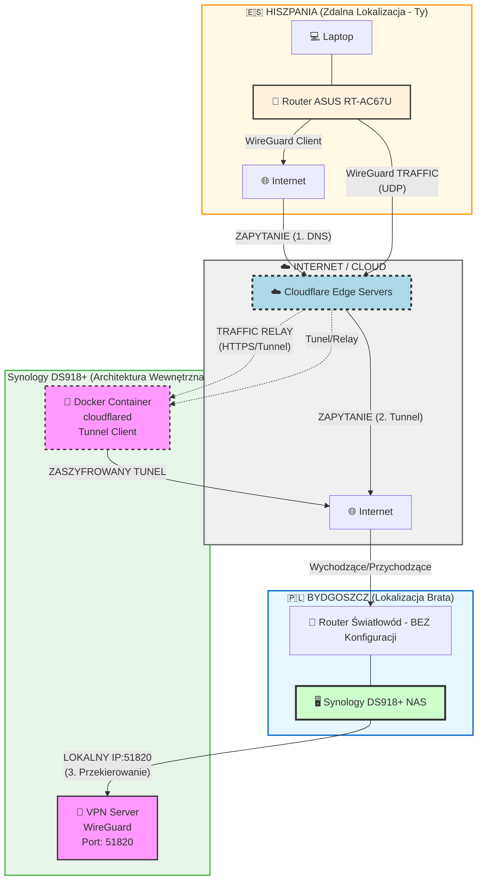

# Network Architecture - VPN Setup via Cloudflare Tunnel

> **Architektura sieci VPN łączącej Hiszpanię z Bydgoszczą przez Cloudflare Tunnel**
> **Data:** 2024-12-02

---

## Diagram Architektury



---

## Opis Architektury

### 🇪🇸 Lokalizacja 1: HISZPANIA (Zdalna)

**Sprzęt:**
- 💻 Laptop (klient VPN)
- 📡 Router ASUS RT-AC67U (skonfigurowany jako WireGuard Client)

**Konfiguracja:**
```yaml
Router ASUS RT-AC67U:
  Role: WireGuard Client
  Endpoint: Cloudflare Edge (przez DNS)
  Traffic: Całość ruchu przez VPN tunnel
  Local Network: 192.168.x.x
```

**Funkcjonalność:**
- Laptop łączy się przez router
- Router nawiązuje połączenie WireGuard z Cloudflare Edge
- Cały ruch jest szyfrowany i przekierowywany przez tunel

---

### ☁️ Warstwa Pośrednia: CLOUDFLARE EDGE

**Komponenty:**
- ☁️ Cloudflare Edge Servers (globalny CDN)
- 🔐 Cloudflare Tunnel (wcześniej Argo Tunnel)

**Przepływ Danych:**
```
1. DNS Query → Cloudflare Edge (publiczny endpoint)
2. Edge Servers → Cloudflare Tunnel
3. Tunnel → cloudflared container w Bydgoszczy
```

**Zalety:**
- ✅ **Brak potrzeby otwierania portów** na routerze w Bydgoszczy
- ✅ **Brak publicznego IP** - wszystko przez Cloudflare
- ✅ **DDoS protection** - ochrona na poziomie Edge
- ✅ **Szyfrowanie end-to-end** - TLS + WireGuard
- ✅ **Globalny zasięg** - najszybszy edge server automatycznie

---

### 🇵🇱 Lokalizacja 2: BYDGOSZCZ (Brata)

**Sprzęt:**
- 📡 Router Światłowód (BEZ konfiguracji - domyślne ustawienia ISP)
- 🖥️ Synology DS918+ NAS

**Architektura NAS:**

#### 1. WireGuard VPN Server
```yaml
Service: VPN Server (Synology Package)
Protocol: WireGuard
Port: 51820 (UDP)
Local IP: 192.168.x.x:51820
Access: Tylko lokalnie (nie eksponowane na internet)
```

**Konfiguracja:**
```ini
[Interface]
PrivateKey = <PRIVATE_KEY>
Address = 10.0.0.1/24
ListenPort = 51820

[Peer]
# Router ASUS w Hiszpanii
PublicKey = <ROUTER_PUBLIC_KEY>
AllowedIPs = 10.0.0.2/32
```

#### 2. Cloudflared Docker Container
```yaml
Container: cloudflared
Image: cloudflare/cloudflared:latest
Function: Cloudflare Tunnel Client
Network Mode: Host
Restart: Always
```

**Docker Compose:**
```yaml
version: '3.8'

services:
  cloudflared:
    image: cloudflare/cloudflared:latest
    container_name: cloudflared
    restart: always
    network_mode: host
    command: tunnel --no-autoupdate run
    environment:
      - TUNNEL_TOKEN=${TUNNEL_TOKEN}
    volumes:
      - ./config:/etc/cloudflared
```

**Tunnel Config:**
```yaml
# /etc/cloudflared/config.yml
tunnel: <TUNNEL_UUID>
credentials-file: /etc/cloudflared/credentials.json

ingress:
  # WireGuard endpoint
  - hostname: vpn.yourdomain.com
    service: udp://localhost:51820

  # Fallback
  - service: http_status:404
```

---

## Przepływ Danych

### 🔄 Połączenie VPN (Step-by-Step)

```
┌─────────────┐
│ 1. DNS      │  Laptop w Hiszpanii → vpn.yourdomain.com
│   Lookup    │  Cloudflare DNS → Cloudflare Edge IP
└──────┬──────┘
       │
       ▼
┌─────────────┐
│ 2. WireGuard│  Router ASUS → WireGuard handshake
│   Handshake │  Target: Cloudflare Edge (UDP)
└──────┬──────┘
       │
       ▼
┌─────────────┐
│ 3. Cloudflare│ Edge Server → Cloudflare Tunnel
│   Tunnel    │  Relay do cloudflared container
└──────┬──────┘
       │
       ▼
┌─────────────┐
│ 4. Container│  cloudflared → localhost:51820
│   Relay     │  Przekierowanie do WireGuard Server
└──────┬──────┘
       │
       ▼
┌─────────────┐
│ 5. VPN      │  WireGuard Server (NAS) → Authorize
│   Establish │  Tunel VPN established ✓
└─────────────┘
```

### 📊 Traffic Flow

**Normalny ruch (po nawiązaniu VPN):**
```
Laptop (10.0.0.2)
   ↓ [WireGuard encrypted]
Router ASUS
   ↓ [UDP packets]
Internet (ISP Hiszpania)
   ↓ [HTTPS/TLS]
Cloudflare Edge Server
   ↓ [Cloudflare Tunnel - encrypted]
Internet (ISP Bydgoszcz)
   ↓ [Local relay]
Router Światłowód
   ↓ [LAN]
NAS - cloudflared container
   ↓ [localhost:51820]
NAS - WireGuard Server
   ↓ [VPN network 10.0.0.0/24]
Resources in Bydgoszcz
```

---

## Bezpieczeństwo

### 🔐 Warstwy Szyfrowania

1. **WireGuard Encryption** (End-to-End)
   - ChaCha20 cipher
   - Poly1305 authentication
   - Perfect Forward Secrecy

2. **Cloudflare Tunnel** (Transport Layer)
   - TLS 1.3
   - Cloudflare's edge encryption
   - DDoS mitigation

3. **Network Level**
   - NAS: Private network only (no exposed ports)
   - Router Bydgoszcz: Default firewall (no configuration needed)

### 🛡️ Security Features

```
┌─────────────────────────────────────┐
│ Security Layers                     │
├─────────────────────────────────────┤
│ ✓ Zero Trust Architecture           │
│ ✓ No open ports on home network     │
│ ✓ Cloudflare DDoS protection        │
│ ✓ WireGuard key-based auth          │
│ ✓ Encrypted tunnel (TLS + WG)       │
│ ✓ Private DNS resolution            │
│ ✓ Rate limiting (Cloudflare)        │
│ ✓ Geo-blocking (optional)           │
└─────────────────────────────────────┘
```

---

## Konfiguracja Krok po Kroku

### 📋 Setup Checklist

#### 🇵🇱 Bydgoszcz (NAS) - Setup

**1. Zainstaluj WireGuard na NAS**
```bash
# Synology Package Center
1. Otwórz Package Center
2. Szukaj "VPN Server"
3. Zainstaluj
4. Włącz WireGuard
5. Konfiguruj:
   - Interface: wg0
   - Port: 51820
   - Address: 10.0.0.1/24
6. Dodaj peer (Router ASUS)
   - Allowed IPs: 10.0.0.2/32
```

**2. Zainstaluj Docker + Cloudflared**
```bash
# SSH do NAS
ssh admin@nas.local

# Utwórz folder dla cloudflared
mkdir -p /volume1/docker/cloudflared
cd /volume1/docker/cloudflared

# Zaloguj się do Cloudflare
docker run -it cloudflare/cloudflared:latest tunnel login

# Utwórz tunel
docker run -it cloudflare/cloudflared:latest tunnel create vpn-tunnel

# Skonfiguruj tunel
cat > config.yml <<EOF
tunnel: <TUNNEL_UUID>
credentials-file: /etc/cloudflared/credentials.json

ingress:
  - hostname: vpn.yourdomain.com
    service: udp://localhost:51820
  - service: http_status:404
EOF

# Uruchom container
docker-compose up -d
```

**3. Konfiguracja DNS (Cloudflare)**
```bash
# Dodaj DNS record
vpn.yourdomain.com → CNAME → <TUNNEL_UUID>.cfargotunnel.com
```

#### 🇪🇸 Hiszpania (Router ASUS) - Setup

**1. Zaloguj się do routera**
```
http://router.asus.com
Login: admin
Password: <your_password>
```

**2. Skonfiguruj WireGuard Client**
```
VPN → VPN Client → Add Profile → WireGuard

[Interface]
PrivateKey = <GENERATE_NEW_KEY>
Address = 10.0.0.2/24
DNS = 1.1.1.1

[Peer]
PublicKey = <NAS_SERVER_PUBLIC_KEY>
Endpoint = vpn.yourdomain.com:51820
AllowedIPs = 0.0.0.0/0
PersistentKeepalive = 25
```

**3. Aktywuj VPN**
```
VPN Client → Select WireGuard Profile → Activate
Status: Connected ✓
```

**4. Test połączenia**
```bash
# Z laptopa w Hiszpanii
ping 10.0.0.1  # NAS IP w VPN
curl http://10.0.0.1:5000  # Test Synology web interface
```

---

## Troubleshooting

### 🔧 Diagnostyka

**Problem 1: Nie łączy się VPN**
```bash
# Sprawdź status cloudflared
docker logs cloudflared

# Sprawdź status WireGuard na NAS
sudo wg show

# Sprawdź firewall
sudo iptables -L -v -n

# Test DNS
nslookup vpn.yourdomain.com
```

**Problem 2: Wolne połączenie**
```bash
# Test prędkości przez tunel
iperf3 -s  # Na NAS
iperf3 -c 10.0.0.1  # Z Hiszpanii

# Sprawdź MTU
ping -M do -s 1472 10.0.0.1

# Optymalizuj MTU w WireGuard config
MTU = 1420  # Dodaj do [Interface]
```

**Problem 3: Cloudflare Tunnel nie działa**
```bash
# Sprawdź tunel status
cloudflared tunnel info <TUNNEL_UUID>

# Sprawdź routing
cloudflared tunnel route dns <TUNNEL_UUID> vpn.yourdomain.com

# Restart container
docker-compose restart cloudflared
```

### 📊 Monitoring

**Sprawdź status systemu:**
```bash
# Router ASUS - status VPN
VPN → VPN Client → Connection Status

# NAS - WireGuard peers
sudo wg show wg0

# Cloudflare - tunnel analytics
https://dash.cloudflare.com → Tunnels
```

---

## Zalety i Wady Rozwiązania

### ✅ Zalety

1. **Brak konfiguracji routera w Bydgoszczy**
   - Nie trzeba otwierać portów
   - Nie trzeba port forwarding
   - Działa za NAT, CGNAT, firewall ISP

2. **Bezpieczeństwo**
   - Zero Trust architecture
   - Cloudflare DDoS protection
   - Double encryption (TLS + WireGuard)
   - Brak publicznego IP exposure

3. **Prostota**
   - Jeden container Docker (cloudflared)
   - Brak skomplikowanej konfiguracji sieci
   - Działa "out of the box"

4. **Wydajność**
   - Cloudflare global network
   - Automatyczny wybór najbliższego edge
   - Low latency

5. **Skalowalność**
   - Można dodać więcej klientów VPN
   - Można dodać więcej tuneli (HTTP, SSH, etc.)
   - Cloudflare Teams (opcjonalnie)

### ❌ Wady / Ograniczenia

1. **Zależność od Cloudflare**
   - Single point of failure
   - Wymaga konta Cloudflare
   - Potencjalne koszty przy dużym ruchu (Free tier: 10GB/mo)

2. **Latencja**
   - Dodatkowy hop przez Cloudflare Edge
   - ~20-50ms więcej niż direct connection

3. **UDP Performance**
   - Cloudflare Tunnel działa najlepiej z TCP
   - UDP może mieć gorsze performance

4. **Troubleshooting**
   - Trudniejsza diagnostyka (więcej warstw)
   - Logi rozproszone (Router, Cloudflare, NAS)

---

## Alternatywne Rozwiązania

### Opcja 1: Tailscale (Najprostrze)
```
✅ Zero configuration
✅ NAT traversal built-in
✅ Mesh network
❌ Wymaga aplikacji na każdym urządzeniu
❌ Trzecia strona (Tailscale Inc.)
```

### Opcja 2: ZeroTier
```
✅ Podobne do Tailscale
✅ Open source
✅ SD-WAN features
❌ Wymaga aplikacji
```

### Opcja 3: Classic VPN (OpenVPN/IPSec)
```
✅ Mature technology
✅ Wide support
❌ Wymaga port forwarding
❌ Trudniejsza konfiguracja
❌ Gorsze performance
```

### Opcja 4: Headscale (Self-hosted Tailscale)
```
✅ Open source alternative do Tailscale
✅ Full control
✅ No third party
❌ Wymaga własnego serwera
❌ Maintenance overhead
```

---

## Performance Expectations

**Typowe wartości:**

| Metryka | Wartość | Uwagi |
|---------|---------|-------|
| Latency | 50-100ms | Hiszpania ↔ Bydgoszcz przez Cloudflare |
| Throughput | 50-100 Mbps | Zależy od ISP w obu lokalizacjach |
| Packet Loss | < 1% | Cloudflare stabilne, WireGuard reliable |
| Connection Stability | 99%+ | Reconnect automatyczny |
| Setup Time | First packet: ~500ms | Handshake + tunnel establishment |

**Test Performance:**
```bash
# Z Hiszpanii (po połączeniu VPN)
ping 10.0.0.1
# Expected: 50-100ms

iperf3 -c 10.0.0.1
# Expected: 50-100 Mbps

curl -o /dev/null http://10.0.0.1:5000
# Expected: < 2s response time
```

---

## Koszt Rozwiązania

### 💰 Cloudflare Free Tier

```
┌─────────────────────────────────────┐
│ Cloudflare Free Plan                │
├─────────────────────────────────────┤
│ Cloudflare Tunnel: DARMOWE          │
│ DNS Management: DARMOWE             │
│ DDoS Protection: DARMOWE            │
│ SSL/TLS: DARMOWE                    │
│                                     │
│ Limits:                             │
│ - Bandwidth: Unlimited (fair use)   │
│ - Tunnels: Unlimited                │
│ - Requests: Unlimited               │
│                                     │
│ TOTAL: 0 PLN/miesiąc ✓              │
└─────────────────────────────────────┘
```

### Opcjonalne Koszty

```
Domain (jeśli nie masz):
  - .com: ~40 PLN/rok
  - .pl: ~50 PLN/rok

Cloudflare Teams (opcjonalnie):
  - Zero Trust Network Access
  - 50 users: $7/user/month
  - Access policies, device posture

VPS (alternatywa dla Cloudflare):
  - Digital Ocean: $6/mo
  - Hetzner: €4/mo
```

---

## Podsumowanie

### 🎯 Kiedy Używać Tego Rozwiązania?

**✅ Idealne dla:**
- Home lab / NAS access
- Remote work / home office
- Brak możliwości konfiguracji routera (ISP restrictions)
- CGNAT / Dynamic IP
- Potrzebujesz DDoS protection
- Chcesz "set and forget" solution

**❌ NIE dla:**
- Gaming (latencja za wysoka)
- High-bandwidth streaming (4K video)
- Mission-critical production (single point of failure)
- Bardzo wysokie wymagania security (third party involved)

### 📈 Możliwe Rozszerzenia

1. **Więcej usług przez Cloudflare Tunnel:**
   ```yaml
   ingress:
     - hostname: nas.yourdomain.com
       service: https://localhost:5001  # Synology DSM
     - hostname: vpn.yourdomain.com
       service: udp://localhost:51820    # WireGuard
     - hostname: ssh.yourdomain.com
       service: ssh://localhost:22       # SSH access
   ```

2. **Cloudflare Access (Zero Trust):**
   - Dodaj authentication przed VPN
   - SSO integration (Google, Microsoft)
   - Device posture checks

3. **Monitoring:**
   - Grafana dashboard dla WireGuard metrics
   - Cloudflare Analytics
   - Uptime monitoring (UptimeRobot)

4. **Failover:**
   - Drugi tunel (backup)
   - Health checks
   - Automatic failover

---

## Kontakt i Wsparcie

**Dokumentacja:**
- WireGuard: https://www.wireguard.com/
- Cloudflare Tunnel: https://developers.cloudflare.com/cloudflare-one/connections/connect-apps
- Synology VPN: https://www.synology.com/en-global/knowledgebase/DSM/help/VPNCenter/vpn_setup

**Community:**
- r/WireGuard
- r/selfhosted
- r/synology

---

**Wersja:** 1.0.0
**Data:** 2024-12-02
**Status:** ✅ Dokumentacja kompletna

---

© 2024 Network Architecture Documentation
